# Отчет по лабораторной работе
## Статическая маршрутизация

### Схема сети
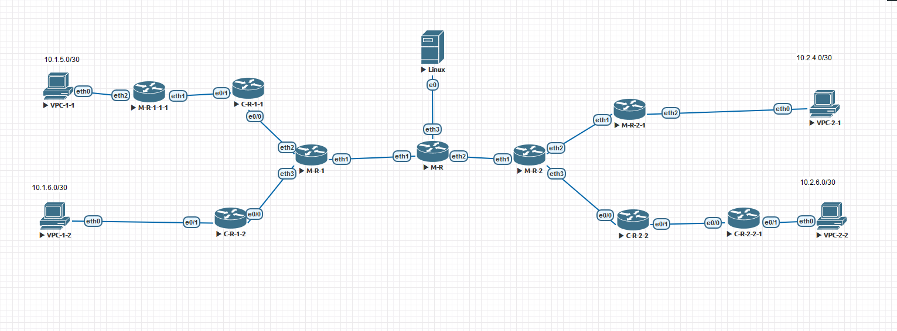

### Таблица интерфейсов на всех устройствах сети

 - M-R:
    - eth1 - 10.1.1.1/30
    - eth2 - 10.2.1.1/30
    - eth3 - 10.3.1.1/30
 - M-R-1:
    - eth1 - 10.1.1.2/30
    - eth2 - 10.1.2.1/30
    - eth3 - 10.1.3.1/30
 - M-R-1-1-1:
    - eth1 - 10.1.4.2/30
    - eth2 - 10.1.5.1/30
 - M-R-2:
    - eth1 - 10.2.1.2/30
    - eth2 - 10.2.2.1/30
    - eth3 - 10.2.3.1/30
 - M-R-2-1:
    - eth1 - 10.2.2.2/30
    - eth2 - 10.2.4.1/30
 - C-R-1-1:
    - e0/0 - 10.1.2.2/30
    - e0/1 - 10.1.4.1/30
 - C-R-1-2:
    - e0/0 - 10.1.3.2/30
    - e0/1 - 10.1.6.1/30
 - C-R-2-2:
    - e0/0 - 10.2.3.2/30
    - e0/1 - 10.2.5.1/30
 - C-R-2-2-1:
    - e0/0 - 10.2.5.2/30
    - e0/1 - 10.2.6.1/30

### Настройки маршрутизации на M-R
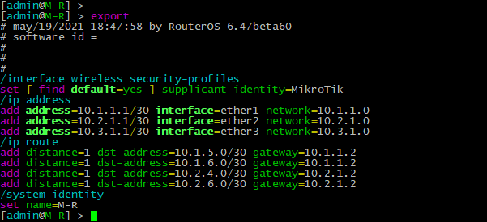

### Настройки маршрутизации на M-R-1
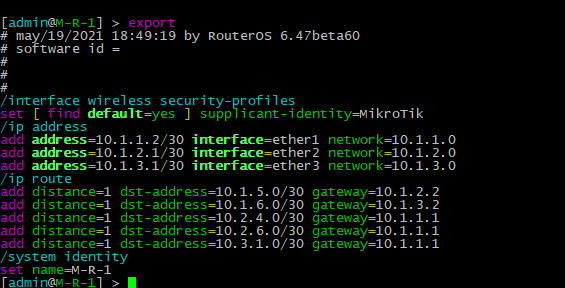

### Настройки маршрутизации на M-R-1-1-1
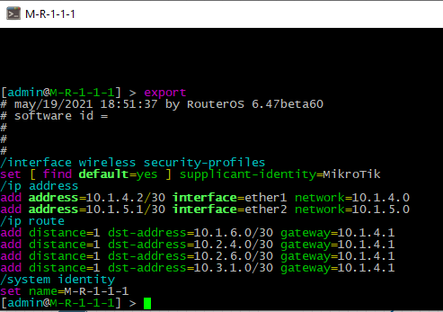

### Настройки маршрутизации на M-R-2
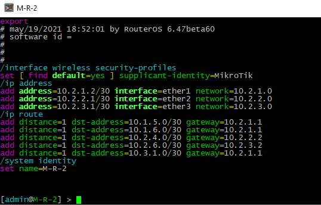

### Настройки маршрутизации на M-R-2-1
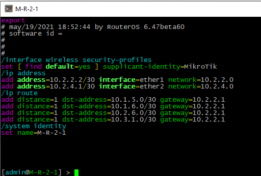

### Настройки маршрутизации на C-R-1-1
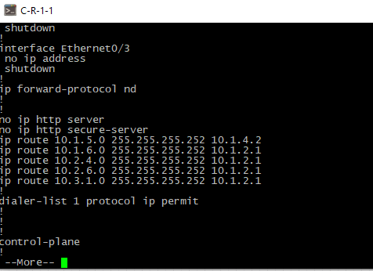

### Настройки маршрутизации на C-R-1-2
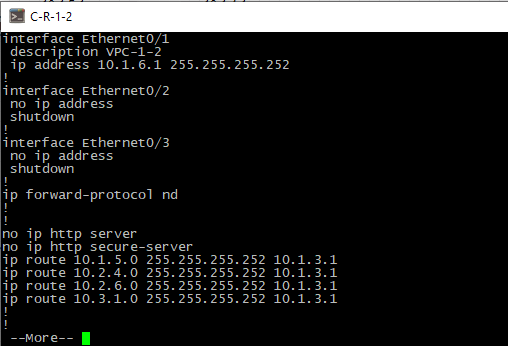

### Настройки маршрутизации на C-R-2-2
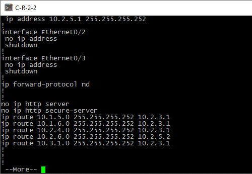

### Настройки маршрутизации на C-R-2-2-1
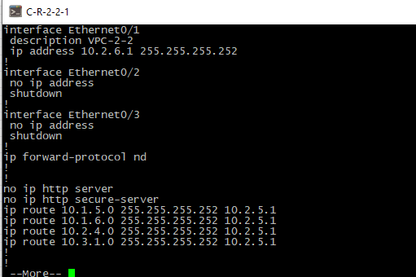

## Проверка

### Ping на VPC11
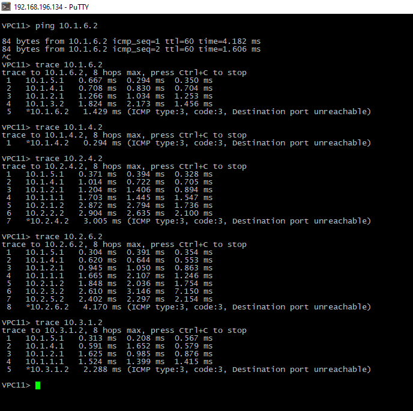

### Ping на VPC12
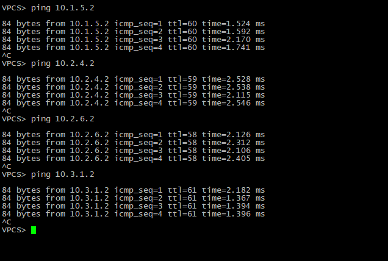

### Ping на VPC21
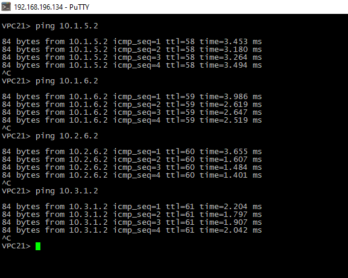

### Ping на VPC22
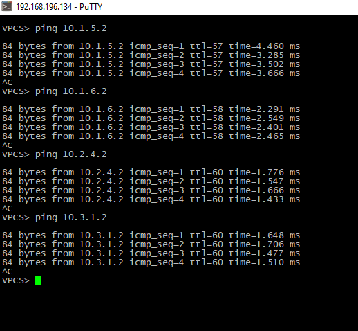

### Ping на LINUX
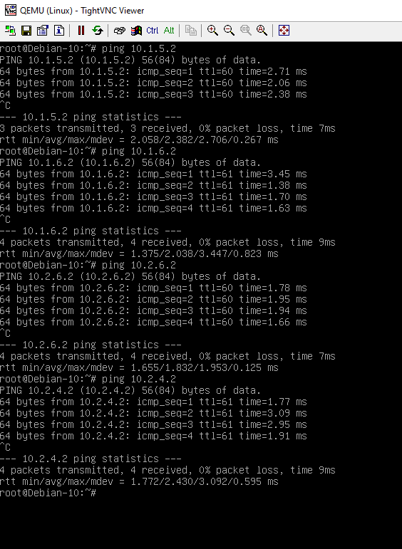
