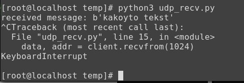
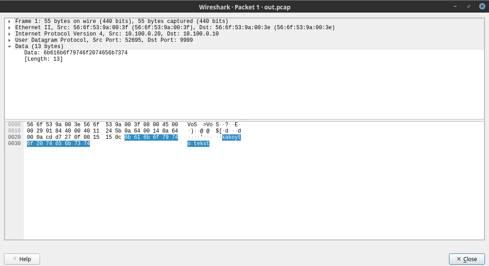

# Отчет по лабораторной работе 1
# По дисциплине: Сетевое администрирование

  - цель: передать сообщение между двумя виртуальными машинами и перехватить его при помощи сниффера

## Подготовка
Создано две виртуальных машины с виртуальными интерфейсами и объеденены в сеть

- Настройки сети первой машины:


       ens7: flags=4163<UP,BROADCAST,RUNNING,MULTICAST>  mtu 1500
        inet 10.100.0.10  netmask 255.255.128.0  broadcast 10.100.127.255
        inet6 fe80::546f:53ff:fe9a:3e  prefixlen 64  scopeid 0x20<link>
        ether 56:6f:53:9a:00:3e  txqueuelen 1000  (Ethernet)
        RX packets 5433373  bytes 1725270625 (1.6 GiB)
        RX errors 0  dropped 0  overruns 0  frame 0
        TX packets 5765899  bytes 1931910623 (1.7 GiB)
        TX errors 0  dropped 0 overruns 0  carrier 0  collisions 0

- Настройка сети на второй машине

       eth1: flags=4163<UP,BROADCAST,RUNNING,MULTICAST>  mtu 1500
        inet 10.100.0.20  netmask 255.255.128.0  broadcast 10.100.127.255
        inet6 fe80::546f:53ff:fe9a:3f  prefixlen 64  scopeid 0x20<link>
        ether 56:6f:53:9a:00:3f  txqueuelen 1000  (Ethernet)
        RX packets 5765319  bytes 1931809690 (1.7 GiB)
        RX errors 0  dropped 0  overruns 0  frame 0
        TX packets 5433041  bytes 1725226979 (1.6 GiB)
        TX errors 0  dropped 0 overruns 0  carrier 0  collisions 0

- Передача сообщения происходит при помощи nc:

`echo -n "kakoyto tekst" | nc -u 10.100.0.10 9999`

- Прием сообщения осуществляется при помощи python скрипта:


```python
import socket

s = socket.socket(socket.AF_INET, socket.SOCK_DGRAM)

s.bind(("", 9999))

client = s

while True:
    data, addr = client.recvfrom(1024)
    print("received message: %s"%data)
```

## Выполнение работы

 - На машине номер 1 запускаем python скрипт
```bash 
python udp_recv.py
```
 - В другом терминале на машине номер 1 запускаем tcpdump
```bash
tcpdump -i ens7 -w out.pcap
```

 - На машине номер 2 запускаем команду
```bash
echo -n "kakoyto tekst" | nc -u 10.100.0.10 9999
```

## Результат
- Вывод python скрипта

  
- Перехваченный пакет в wireshark 
