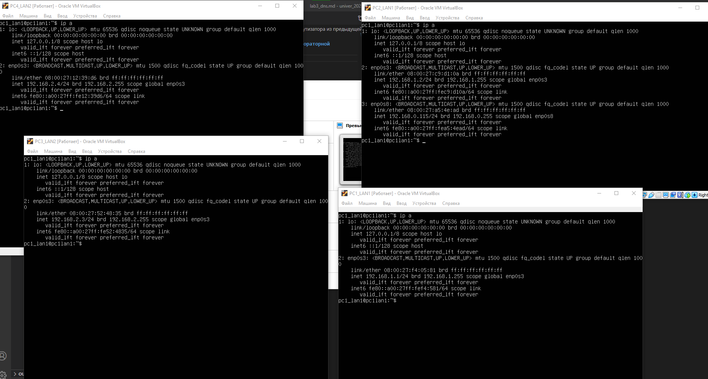
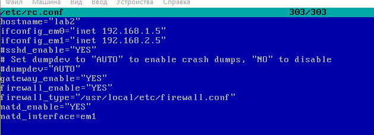
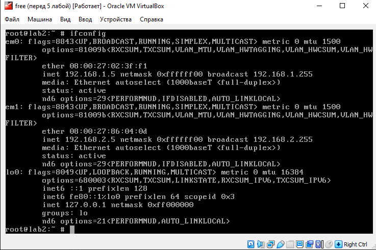
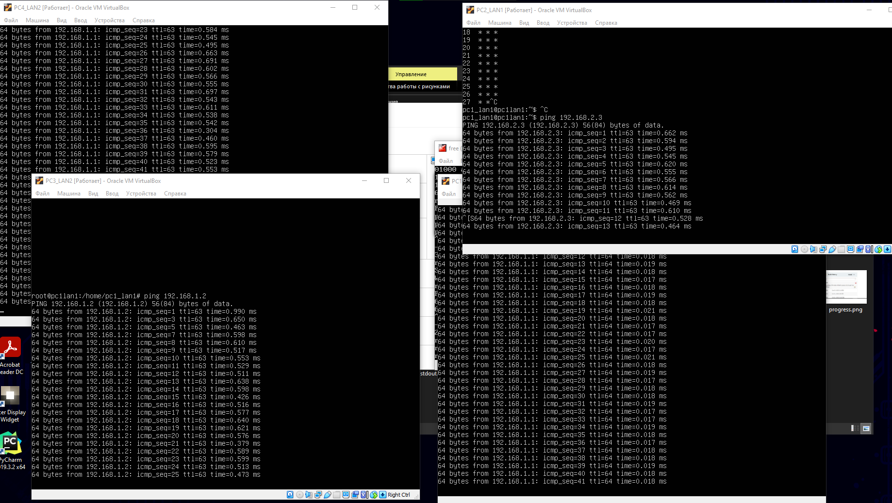

# Отчет по лабораторной работ
## Объединение двух сетей при помощи маршрутизатора из предыдущей лабораторной

### VM в разных подсетях
Создано 4 виртуальных машины. 2 в сети 192.168.1.0/24, 2 в сети 192.168.2.0/24

### Настройки маршрутизации на freebsd

### Настройки интерфейсов на freebsd 

### Ping идет между хостами
