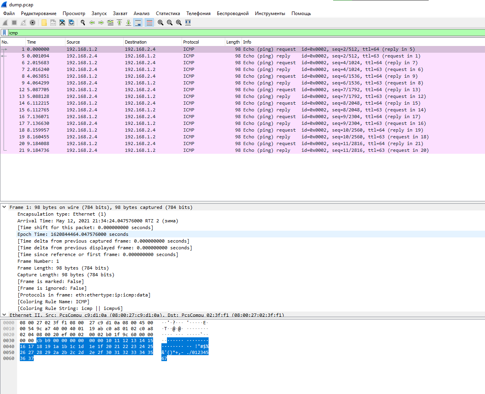

# Отчет по лабораторной работ
## Просмотр перехваченных пакетов при помощи tcpdump

### Выполняем запись пакетов при помощи tcpdump
```bash
sudo tcpdump -i enp0s3 -w dump.pcap
```

На pc2_lan1 настроен дополнительный bridge интерфейс. С его помощью через ssh забираем записанный дамп с зоны:
```bash
scp pc1_lan1@192.168.0.115:/home/pc1_lan1/dump.pcap .
```

### Отображение перехваченных пакетов в wireshark
