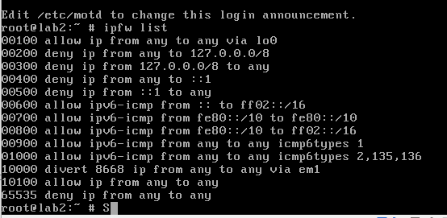

# Отчет по лабораторной работ
## Включение Nat и firewall на freebsd

### Вклюбчаем NAT и Firewall

### Проверяем маршрутизацию

## Вывод:
### На lan2 пакеты приходят от маршрутизатора(с 192.168.2.5), а уходят на удаленный хост(192.168.1.1)