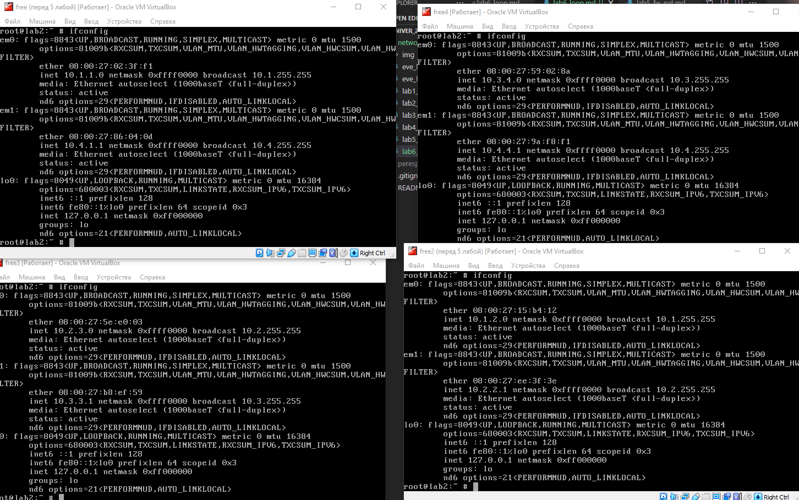
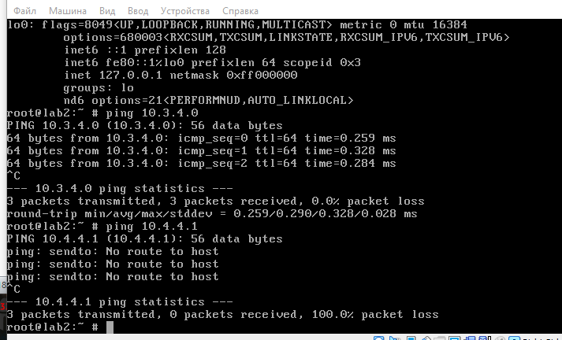
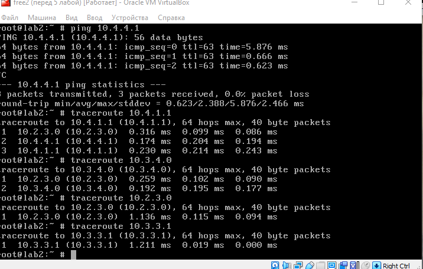
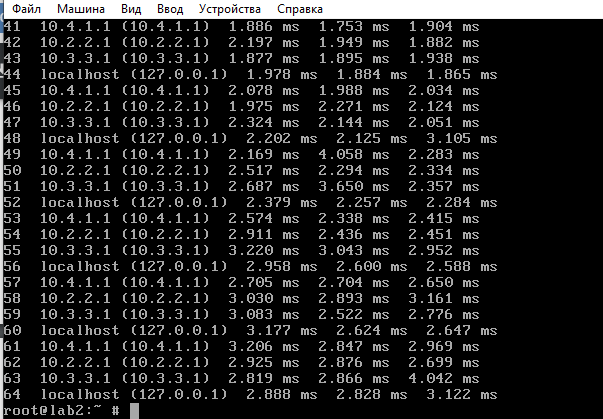
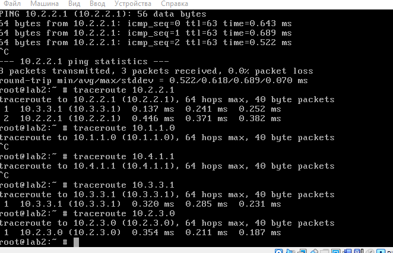

# Отчет по лабораторной работ
## Маршрутизация при объединении нескольких сетей

### Создано 4 локальных сети 

### Ping между разными сетями не идет

### На всех маршрутизаторах добавляем маршруты во все сети
Теперь с любого роутера достапна любая другая подсеть:

### Зацикленный пакет для несуществующей сети
 

## Второй способ: прописываем для всех роутеров конкретные маршруты

### Пакеты идут напрямую в нужные сети

### В несуществующие сети не идут
